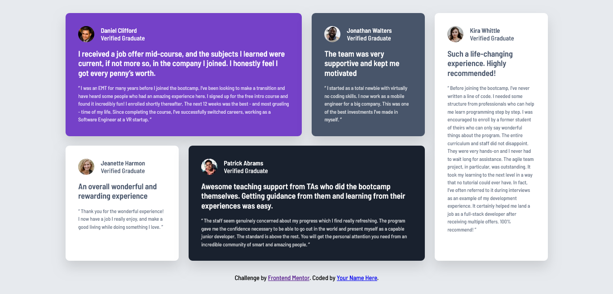

# Frontend Mentor - Testimonials grid section solution

This is a solution to the [Testimonials grid section challenge on Frontend Mentor](https://www.frontendmentor.io/challenges/testimonials-grid-section-Nnw6J7Un7). Frontend Mentor challenges help you improve your coding skills by building realistic projects. 

## Table of contents

- [Overview](#overview)
  - [The challenge](#the-challenge)
  - [Screenshot](#screenshot)
  - [Links](#links)
- [My process](#my-process)
  - [Built with](#built-with)
  - [What I learned](#what-i-learned)
  - [Continued development](#continued-development)
  - [AI Collaboration](#ai-collaboration)
- [Author](#author)
## Overview

### The challenge

Users should be able to:

- View the optimal layout for the site depending on their device's screen size

### Screenshot

### Links

- Solution URL: [Add solution URL here](https://your-solution-url.com)
- Live Site URL: [Add live site URL here](https://your-live-site-url.com)

## My process
  - Analize the design both desktop and mobile
  - added an html tags, using semantic elements
  - added an css
  - added an responsiveness
  - refine with ai

### Built with
  - Semantic HTML5
  - CSS Custom Properties
  - Flexbox
  - CSS Grid
  - Mobile-First Workflow
  - Responsive Design
  - Google Fonts (Barlow Semi Condensed)

### What I learned
This project helped me gain more confidence using CSS Grid for complex layouts. The desktop version required cards to span multiple rows and columns, which helped me better understand grid-template-areas.

I also practiced combining Grid and Flexbox together. Grid handled the overall page layout, while Flexbox was useful for aligning profile images and text inside each testimonial card.

Example of a grid layout I used:

main {
    display: grid;
    grid-template-areas:
        "card1 card1 card2 card5"
        "card3 card4 card4 card5";
}

Another thing I learned was how important it is to avoid fixed heights when working with content that can vary in length. Allowing the cards to grow naturally made the layout more responsive.

### Continued development
In future projects I want to continue improving:

CSS Grid layouts
Responsive design without relying on fixed dimensions
Mobile-first development
Creating layouts from design files more independently
Writing cleaner and more maintainable CSS
Useful Resources
Frontend Mentor - For providing realistic frontend challenges.
MDN Web Docs - Helped me understand CSS Grid and Flexbox properties.
ChatGPT - Used for debugging, learning CSS concepts, and understanding responsive design techniques.

### AI Collaboration
For this project, I used ChatGPT as a learning assistant rather than a code generator.

I used AI to:

Understand CSS Grid concepts
Debug layout issues
Learn responsive design techniques
Get explanations for CSS properties
Review and improve my code structure

What worked well:

Breaking down complex Grid layouts into smaller steps
Explaining why certain CSS approaches worked better than others
Helping identify responsiveness issues

What didn't work well:

Some generated solutions needed adjustments to fit my specific layout
I still needed to test and understand the code myself before using it

Overall, AI was most helpful as a learning tool and debugging partner.

## Author

- Website - [Add your name here](https://www.your-site.com)
- Frontend Mentor - [@yourusername](https://www.frontendmentor.io/profile/yourusername)
- Twitter - [@yourusername](https://www.twitter.com/yourusername)
